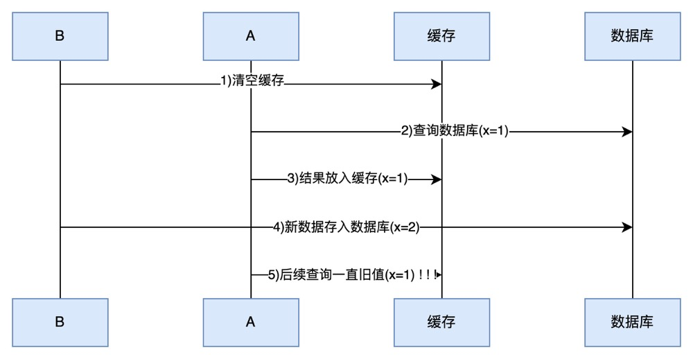

# J.U.C

## 1.*AQS原理

### 1.1概述

全称是 AbstractQueuedSynchronizer，是阻塞式锁和相关的同步器工具的框架

特点：

- 用 state 属性来表示资源的状态（分独占模式和共享模式），子类需要定义如何维护这个状态，控制如何获取
  锁和释放锁
    - getState - 获取 state 状态
    - setState - 设置 state 状态
    - compareAndSetState - cas 机制设置 state 状态
    - 独占模式是只有一个线程能够访问资源，而共享模式可以允许多个线程访问资源
- 提供了基于 FIFO 的等待队列，类似于 Monitor 的 EntryList
- 条件变量来实现等待、唤醒机制，支持多个条件变量，类似于 Monitor 的 WaitSet

子类主要实现这样一些方法（默认抛出 UnsupportedOperationException）

- tryAcquire
- tryRelease
- tryAcquireShared
- tryReleaseShared
- isHeldExclusively

获取锁的姿势

```java
// 如果获取锁失败
if(!tryAcquire(arg)){
        // 入队, 可以选择阻塞当前线程 park unpark
        }
```

释放锁的姿势

```java
// 如果释放锁成功
if(tryRelease(arg)){
        // 让阻塞线程恢复运行
        }
```

### 1.2 实现不可重入锁

**自定义同步器**

```java
public class CustomSync extends AbstractQueuedSynchronizer {

    @Override
    protected boolean tryAcquire(int acquires) {
        if (acquires == 1) {
            if (compareAndSetState(0, 1)) {
                setExclusiveOwnerThread(Thread.currentThread());
                return true;
            }
        }
        return false;
    }

    @Override
    protected boolean tryRelease(int acquires) {
        if (acquires == 1) {
            setExclusiveOwnerThread(null);
            setState(0);
            return true;
        }
        return false;
    }

    @Override
    protected boolean isHeldExclusively() {
        return getState() == 1;
    }

    protected Condition newCondition() {
        return new ConditionObject();
    }
}

```

```java
public class CustomLock implements Lock {

    private CustomSync sync = new CustomSync();

    // 尝试，不成功，进入等待队列
    @Override
    public void lock() {
        sync.acquire(1);
    }

    // 尝试，不成功，进入等待队列，可打断
    @Override
    public void lockInterruptibly() throws InterruptedException {
        sync.acquireInterruptibly(1);
    }

    // 尝试一次，不成功返回，不进入队列
    @Override
    public boolean tryLock() {
        return sync.tryAcquire(1);
    }

    // 尝试，不成功，进入等待队列，有时限
    @Override
    public boolean tryLock(long time, TimeUnit unit) throws InterruptedException {
        return sync.tryAcquireNanos(1, unit.toNanos(time));
    }

    // 释放锁
    @Override
    public void unlock() {
        sync.release(1);
    }


    // 生成条件变量
    @Override
    public Condition newCondition() {
        return sync.newCondition();
    }
    
}
```

### 1.3 心得

#### 起源

早期程序员会自己通过一种同步器去实现另一种相近的同步器，例如用可重入锁去实现信号量，或反之。这显然不够优雅，于是在 JSR166（java 规范提案）中创建了 AQS，提供了这种通用的同步器机制。

#### 目标

AQS 要实现的功能目标

- 阻塞版本获取锁 acquire 和非阻塞的版本尝试获取锁 tryAcquire
- 获取锁超时机制
- 通过打断取消机制
- 独占机制及共享机制
- 条件不满足时的等待机制

要实现的性能目标

> Instead, the primary performance goal here is scalability: to predictably maintain efficiency even, or
> especially, when synchronizers are contended

#### 设计

AQS 的基本思想其实很简单

获取锁的逻辑

```java
while(state 状态不允许获取){
    if(队列中还没有此线程){
    入队并阻塞
    }
}
    当前线程出队
```

释放锁的逻辑

```java
if(state 状态允许了){
    恢复阻塞的线程(s)
}
```

要点

- 原子维护 state 状态
- 阻塞及恢复线程
- 维护队列
-

##### 1） state 设计

##### 2） 阻塞恢复设计

##### 3） 队列设计

**主要用到 AQS 的并发工具类**

## 2.*ReentranLock原理

### 1.非公平锁实现原理

#### 加锁解锁流程

#### 加锁源码

#### 解锁源码

### 2.可重入原理

### 3.可打断原理

#### 不可打断模式

#### 可打断模式

### 4.公平锁实现原理

### 5.条件变量实现原理

#### await 流程

#### signal 流程

#### 源码

## 3.读写锁

### 3.1ReentrantReadWriteLock

当读操作远远高于写操作时，这时候使用 `读写锁` 让 `读-读` 可以并发，提高性能。 类似于数据库中的 `select ...from ... lock in share mode`

提供一个 `数据容器类` 内部分别使用读锁保护数据的 `read()` 方法，写锁保护数据的 `write()` 方法

#### 注意事项

- 读锁不支持条件变量
- 重入时升级不支持：即持有读锁的情况下去获取写锁，会导致获取写锁永久等待
- 重入时降级支持：即持有写锁的情况下去获取读锁

#### 应用之缓存

1. ##### 缓存更新策略

更新时，是先清缓存还是先更新数据库



先清缓存


先更新数据库


补充一种情况，假设查询线程 A 查询数据时恰好缓存数据由于时间到期失效，或是第一次查询

这种情况的出现几率非常小，见 facebook 论文

2. ##### 读写锁实现一致性缓存

使用读写锁实现一个简单的按需加载缓存

```java

```

> **注意**
>
> - 以上实现体现的是读写锁的应用，保证缓存和数据库的一致性，但有下面的问题没有考虑到
> - 适合读多写少，如果写操作比较频繁，以上实现性能低
> - 没有考虑缓存容量
> - 没有考虑缓存过期
> - 只适合单机
> - 并发性还是低，目前只会用一把锁
> - 更新方法太过简单粗暴，清空了所有 key（考虑按类型分区或重新设计 key）
> - 乐观锁实现：用 CAS 去更新

#### 读写锁原理

**1.图解流程**

读写锁用的是同一个 Sycn 同步器，因此等待队列、state 等也是同一个

**t1 w.lock，t2 r.lock**

1） t1 成功上锁，流程与 ReentrantLock 加锁相比没有特殊之处，不同是写锁状态占了 state 的低 16 位，而读锁 使用的是 state 的高 16 位


2）t2 执行 r.lock，这时进入读锁的 sync.acquireShared(1) 流程，首先会进入 tryAcquireShared 流程。如果有写 锁占据，那么 tryAcquireShared 返回 -1 表示失败

> **tryAcquireShared 返回值表示**
>
> - -1 表示失败
> - 0 表示成功，但后继节点不会继续唤醒
> - 正数表示成功，而且数值是还有几个后继节点需要唤醒，读写锁返回 1


3）这时会进入 sync.doAcquireShared(1) 流程，首先也是调用 addWaiter 添加节点，不同之处在于节点被设置为 Node.SHARED 模式而非 Node.EXCLUSIVE 模式，注意此时 t2 仍处于活跃状态


4）t2 会看看自己的节点是不是老二，如果是，还会再次调用 tryAcquireShared(1) 来尝试获取锁

5）如果没有成功，在 doAcquireShared 内 for (;;) 循环一次，把前驱节点的 waitStatus 改为 -1，再 for (;;) 循环一 次尝试 tryAcquireShared(1) 如果还不成功，那么在
parkAndCheckInterrupt() 处 park

### 3.2 StampedLock

该类自 JDK 8 加入，是为了进一步优化读性能，它的特点是在使用读锁、写锁时都必须配合【戳】使用 加解读锁


> **注意**
>
> - StampedLock 不支持条件变量
> - StampedLock 不支持可重入

## 4.Semaphore

### 基本使用

​    [ˈsɛməˌfɔr] 信号量，用来限制能同时访问共享资源的线程上限。

### \* Semaphore 应用

### \* Semaphore 原理

## 5.CountdownLatch

用来进行线程同步协作，等待所有线程完成倒计时。

其中构造参数用来初始化等待计数值，await() 用来等待计数归零，countDown() 用来让计数减一

可以配合线程池使用，改进如下

### \* 应用之同步等待多线程准备完毕

### \* 应用之同步等待多个远程调用结束

## 6.CyclicBarrier

​    [ˈsaɪklɪk ˈbæriɚ] 循环栅栏，用来进行线程协作，等待线程满足某个计数。构造时设置『计数个数』，每个线程执 行到某个需要“同步”的时刻调用 await() 方法进行等待，当等待的线程数满足『计数个数』时，继续执行


> **注意**
>
> CyclicBarrier 与 CountDownLatch 的主要区别在于 CyclicBarrier 是可以重用的 CyclicBarrier 可以被比 喻为『人满发车』

## 7.线程安全集合类概述

线程安全集合类可以分为三大类：

- 遗留的线程安全集合如 `Hashtable` ， `Vector`
- 使用 Collections 装饰的线程安全集合，如：
    - `Collections.synchronizedCollection`
    - `Collections.synchronizedList`
    - `Collections.synchronizedMap`
    - `Collections.synchronizedSet`
    - `Collections.synchronizedNavigableMap`
    - `Collections.synchronizedNavigableSet`
    - `Collections.synchronizedSortedMap`
    - `Collections.synchronizedSortedSet`
- `java.util.concurrent.*`

重点介绍 `java.util.concurrent.*` 下的线程安全集合类，可以发现它们有规律，里面包含三类关键词： `Blocking`、`CopyOnWrite`、`Concurrent`

- `Blocking`  大部分实现基于锁，并提供用来阻塞的方法
- `CopyOnWrite` 之类容器修改开销相对较重
- `Concurrent` 类型的容器
    - 内部很多操作使用 cas 优化，一般可以提供较高吞吐量
    - 弱一致性
        - 遍历时弱一致性，例如，当利用迭代器遍历时，如果容器发生修改，迭代器仍然可以继续进行遍 历，这时内容是旧的
        - 求大小弱一致性，size 操作未必是 100% 准确
        - 读取弱一致性

> **注意**
>
> 遍历时如果发生了修改，对于非安全容器来讲，使用 fail-fast 机制也就是让遍历立刻失败，抛出 ConcurrentModificationException，不再继续遍历

## 8.ConcurrentHashMap

## 9.BlockingQueue

## 10.ConcurrentLinkedQueue

## 11.CopyOnWriteArrayList