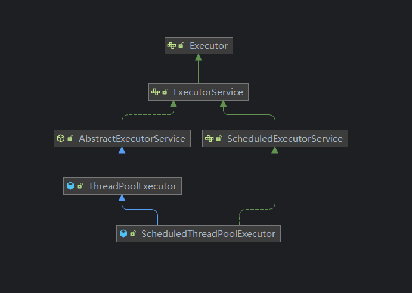
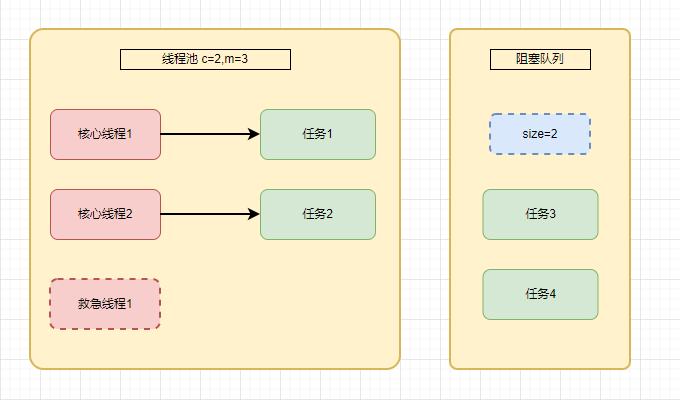
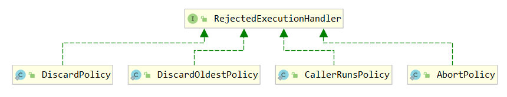
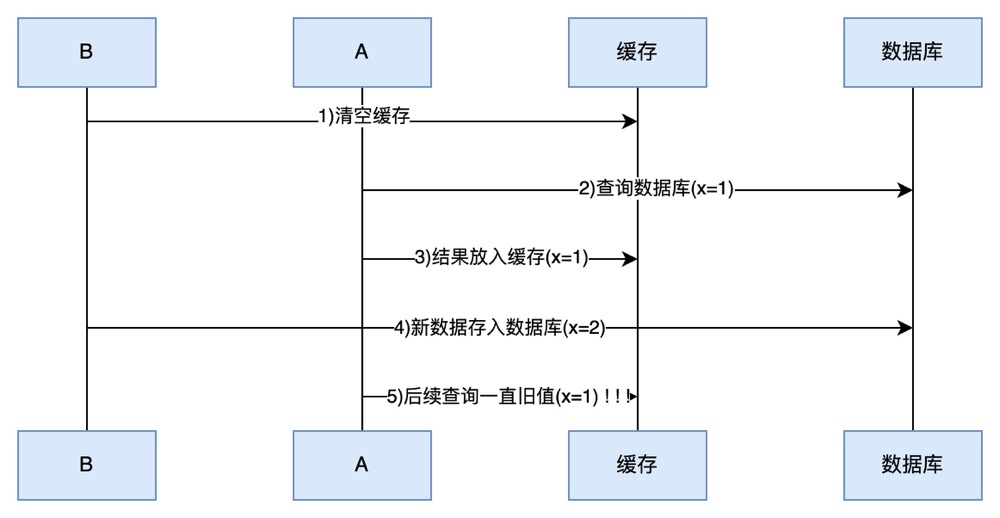
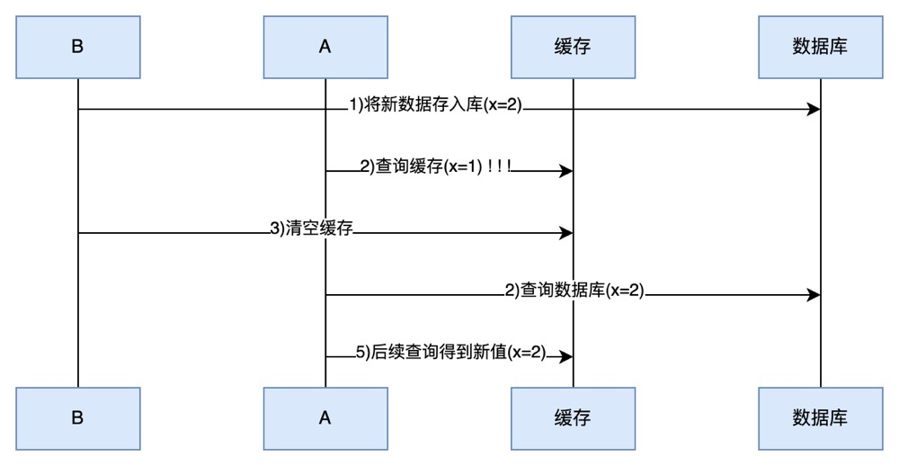
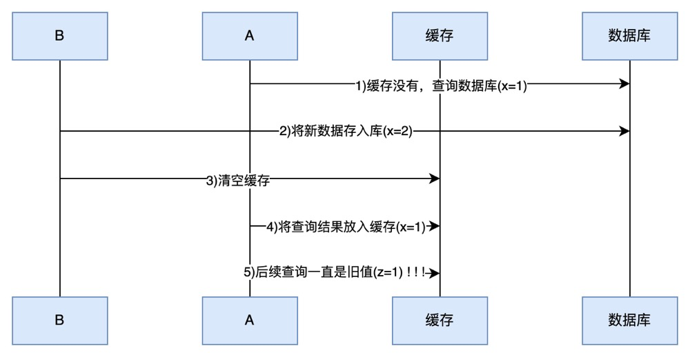
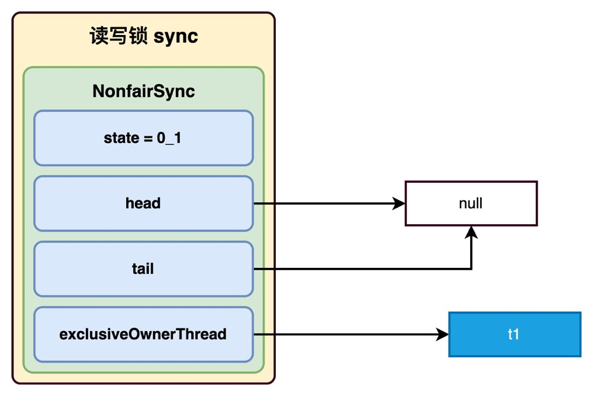
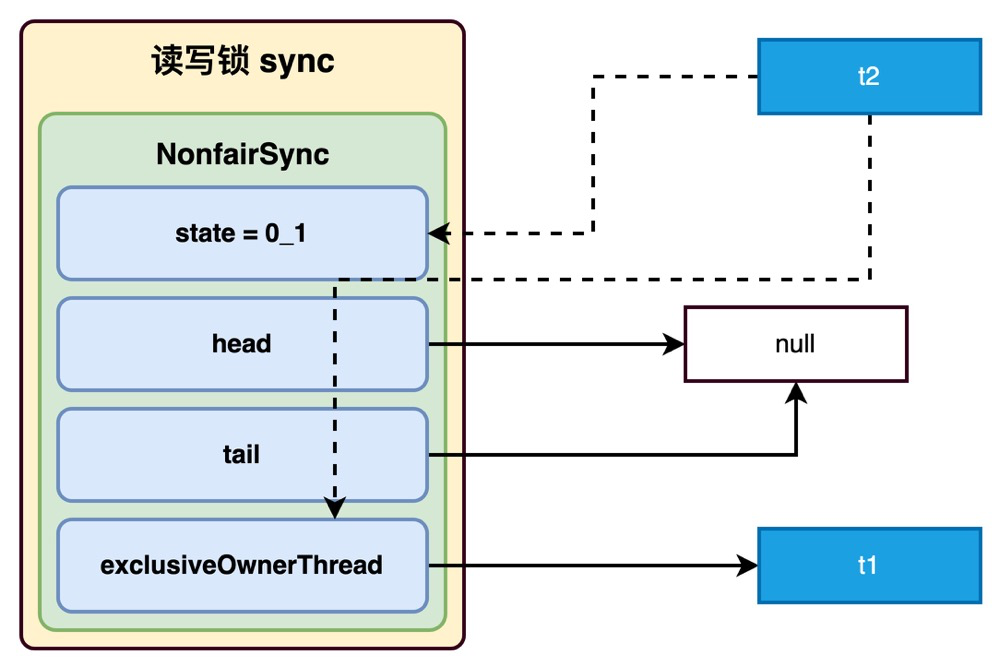
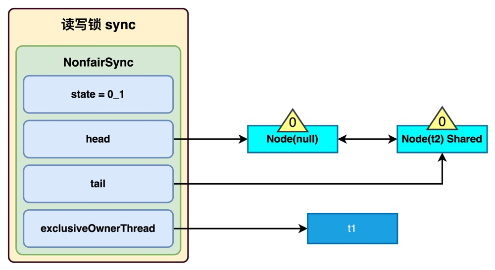

# 并发编程

## 8. 共享模型之工具

### 8.1 线程池

#### 1.自定义线程池

#### 2.ThreadPoolExecutor



##### 1）线程池状态

ThreadPoolExecutor 使用 int 的高 3 位来表示线程池状态，低 29 位表示线程数量

| 状态名     | 高 3位 | 接收新任务 | 处理阻塞队列任务 | 说明                                      |
| ---------- | ------ | ---------- | ---------------- | ----------------------------------------- |
| RUNNING    | 111    | Y          | Y                |                                           |
| SHUTDOWN   | 000    | N          | Y                | 不会接收新任务，但会处理阻塞队列剩余任务  |
| STOP       | 001    | N          | N                | 会中断正在执行的任务，并抛弃阻塞队列任务  |
| TIDYING    | 010    | -          | -                | 任务全执行完毕，活动线程为 0 即将进入终结 |
| TERMINATED | 011    | -          | -                | 终结状态                                  |

从数字上比较，TERMINATED > TIDYING > STOP > SHUTDOWN > RUNNING
这些信息存储在一个原子变量 ctl 中，目的是将线程池状态与线程个数合二为一，这样就可以用一次 cas 原子操作进行赋值

```java
// c 为旧值， ctlOf 返回结果为新值
ctl.compareAndSet(c,ctlOf(targetState,workerCountOf(c))));
// rs 为高 3 位代表线程池状态， wc 为低 29 位代表线程个数，ctl 是合并它们
private static int ctlOf(int rs,int wc){return rs|wc;}
```

##### 2）构造方法

```java
    public ThreadPoolExecutor(int corePoolSize,
        int maximumPoolSize,
        long keepAliveTime,
        TimeUnit unit,
        BlockingQueue<Runnable> workQueue,
        ThreadFactory threadFactory,
        RejectedExecutionHandler handler) 
```

- corePoolSize 核心线程数目 (最多保留的线程数)
- maximumPoolSize 最大线程数目
- keepAliveTime 生存时间 - 针对救急线程
- unit 时间单位 - 针对救急线程
- workQueue 阻塞队列
- threadFactory 线程工厂 - 可以为线程创建时起个好名字
- handler 拒绝策略

工作方式：



- 线程池中刚开始没有线程，当一个任务提交给线程池后，线程池会创建一个新线程来执行任务。

- 当线程数达到 corePoolSize 并没有线程空闲，这时再加入任务，新加的任务会被加入workQueue 队列排队，直到有空闲的线程。

- 如果队列选择了有界队列，那么任务超过了队列大小时，会创建 maximumPoolSize - corePoolSize 数目的线程来救急。

- 如果线程到达 maximumPoolSize 仍然有新任务这时会执行拒绝策略。拒绝策略 jdk 提供了 4 种实现，其它著名框架也提供了实现

  - AbortPolicy 让调用者抛出 RejectedExecutionException 异常，这是默认策略
  - CallerRunsPolicy 让调用者运行任务
  - DiscardPolicy 放弃本次任务
  - DiscardOldestPolicy 放弃队列中最早的任务，本任务取而代之
  - Dubbo 的实现，在抛出 RejectedExecutionException 异常之前会记录日志，并 dump 线程栈信息，方便定位问题
  - Netty 的实现，是创建一个新线程来执行任务
  - ActiveMQ 的实现，带超时等待（60s）尝试放入队列，类似我们之前自定义的拒绝策略
  - PinPoint 的实现，它使用了一个拒绝策略链，会逐一尝试策略链中每种拒绝策略

- 当高峰过去后，超过corePoolSize 的救急线程如果一段时间没有任务做，需要结束节省资源，这个时间由keepAliveTime 和 unit 来控制。

  

  根据这个构造方法，JDK Executors 类中提供了众多工厂方法来创建各种用途的线程池

##### 3）newFixedThreadPool

```java
public static ExecutorService newFixedThreadPool(int nThreads){
        return new ThreadPoolExecutor(nThreads,nThreads,
        0L,TimeUnit.MILLISECONDS,
        new LinkedBlockingQueue<Runnable>());
        }
```

特点

- 核心线程数 == 最大线程数（没有救急线程被创建），因此也无需超时时间
- 阻塞队列是无界的，可以放任意数量的任务

> **评价**：适用于任务量已知，相对耗时的任务

```java
ExecutorService executorService=Executors.newFixedThreadPool(10);
```

##### 4）newCachedThreadPool

```java
public static ExecutorService newCachedThreadPool(){
        return new ThreadPoolExecutor(0,Integer.MAX_VALUE,
        60L,TimeUnit.SECONDS,
        new SynchronousQueue<Runnable>());
        }
```

特点

- 核心线程数是 0， 最大线程数是 Integer.MAX_VALUE，救急线程的空闲生存时间是 60s，意味着

  - 全部都是救急线程（60s 后可以回收）
  - 救急线程可以无限创建

- 队列采用了 SynchronousQueue 实现特点是，它没有容量，没有线程来取是放不进去的（一手交钱、一手交货）

  - ```java
    SynchronousQueue<Integer> synchronousQueue = new SynchronousQueue<>();
    
            new Thread(() -> {
                try {
                    log.info("put 1");
                    synchronousQueue.put(1);
                    log.info("put 1 success");
    
                    log.info("put 2");
                    synchronousQueue.put(2);
                    log.info("put 2 success");
    
                    log.info("put 3");
                    synchronousQueue.put(3);
                    log.info("put 3 success");
                } catch (InterruptedException e) {
                    e.printStackTrace();
                }
            }).start();
    
            Thread.sleep(1000);
    
            new Thread(() -> {
                try {
                    log.info("take");
                    Integer i = synchronousQueue.take();
                    log.info("take {} success",i);
                } catch (InterruptedException e) {
                    e.printStackTrace();
                }
            }).start();
    
            Thread.sleep(1000);
    
            new Thread(() -> {
                try {
                    log.info("take");
                    Integer i = synchronousQueue.take();
                    log.info("take {} success",i);
                } catch (InterruptedException e) {
                    e.printStackTrace();
                }
            }).start();
    
            Thread.sleep(1000);
    
            new Thread(() -> {
                try {
                    log.info("take");
                    Integer i = synchronousQueue.take();
                    log.info("take {} success",i);
                } catch (InterruptedException e) {
                    e.printStackTrace();
                }
            }).start();
    ```

      输出

      ```java
      16:04:53.220 [Thread-0] INFO cn.liyohe.juc.chapter8.threadpool.CachedThreadPoolMain - put 1
      16:04:54.201 [Thread-1] INFO cn.liyohe.juc.chapter8.threadpool.CachedThreadPoolMain - take
      16:04:54.201 [Thread-0] INFO cn.liyohe.juc.chapter8.threadpool.CachedThreadPoolMain - put 1 success
      16:04:54.202 [Thread-0] INFO cn.liyohe.juc.chapter8.threadpool.CachedThreadPoolMain - put 2
      16:04:54.201 [Thread-1] INFO cn.liyohe.juc.chapter8.threadpool.CachedThreadPoolMain - take 1 success
      16:04:55.204 [Thread-2] INFO cn.liyohe.juc.chapter8.threadpool.CachedThreadPoolMain - take
      16:04:55.204 [Thread-2] INFO cn.liyohe.juc.chapter8.threadpool.CachedThreadPoolMain - take 2 success
      16:04:55.204 [Thread-0] INFO cn.liyohe.juc.chapter8.threadpool.CachedThreadPoolMain - put 2 success
      16:04:55.204 [Thread-0] INFO cn.liyohe.juc.chapter8.threadpool.CachedThreadPoolMain - put 3
      16:04:56.204 [Thread-3] INFO cn.liyohe.juc.chapter8.threadpool.CachedThreadPoolMain - take
      16:04:56.204 [Thread-3] INFO cn.liyohe.juc.chapter8.threadpool.CachedThreadPoolMain - take 3 success
      16:04:56.204 [Thread-0] INFO cn.liyohe.juc.chapter8.threadpool.CachedThreadPoolMain - put 3 success
      ```

      > **评价**：整个线程池表现为线程数会根据任务量不断增长，没有上限，当任务执行完毕，空闲 1分钟后释放线程。 适合任务数比较密集，但每个任务执行时间较短的情况

##### 5）newSingleThreadPool

```java
public static ExecutorService newSingleThreadExecutor(){
        return new FinalizableDelegatedExecutorService
        (new ThreadPoolExecutor(1,1,
        0L,TimeUnit.MILLISECONDS,
        new LinkedBlockingQueue<Runnable>()));
        }
```

使用场景

希望多个任务排队执行。线程数固定为 1，任务数多于 1 时，会放入无界队列排队。任务执行完毕，这唯一的线程也不会被释放。

区别：

- 自己创建一个单线程串行执行任务，如果任务执行失败而终止那么没有任何补救措施，而线程池还会新建一个线程，保证池的正常工作
- Executors.newSingleThreadExecutor() 线程个数始终为1，不能修改
  - FinalizableDelegatedExecutorService 应用的是装饰器模式，只对外暴露了 ExecutorService 接口，因此不能调用 ThreadPoolExecutor 中特有的方法
- xecutors.newFixedThreadPool(1) 初始时为1，以后还可以修改
  - 对外暴露的是 ThreadPoolExecutor 对象，可以强转后调用 setzhCorePoolSize 等方法进行修改

##### 6）提交任务

```java
// 执行任务
void execute(Runnable command);

// 提交任务 task 用返回值 Future 获得执行结果
<T> Future<T> submit(Runnable<T> task);

// 提交 Task 中所有任务
<T> List<Future<T>>invokeAll(Collection<?extends Callable<T>> tasks)
        throws InterruptedException;

// 提交 Task 中所有任务，带超时时间
<T> List<Future<T>>invokeAll(Collection<?extends Callable<T>> tasks,
        long timeout,TimeUnit unit)
        throws InterruptedException;

// 提交 tasks 中所有任务，哪个任务先成功执行完毕，返回此任务执行结果，其它任务取消
<T> T invokeAny(Collection<?extends Callable<T>> tasks)
        throws InterruptedException,ExecutionException;

// 提交 tasks 中所有任务，哪个任务先成功执行完毕，返回此任务执行结果，其它任务取消，带超时时间
<T> T invokeAny(Collection<?extends Callable<T>> tasks,
        long timeout,TimeUnit unit)
        throws InterruptedException,ExecutionException,TimeoutException;
```

##### 7）关闭线程池

**shutdown**

```java
/*
线程池状态变为 SHUTDOWN
- 不会接收新任务
- 但已提交任务会执行完
- 此方法不会阻塞调用线程的执行
*/
void shutdown();
```

```java
public void shutdown(){
final ReentrantLock mainLock=this.mainLock;
        mainLock.lock();
        try{
        checkShutdownAccess();
        // 修改线程池状态
        advanceRunState(SHUTDOWN);
        // 仅打断空闲线程
        interruptIdleWorkers();
        onShutdown(); // hook for ScheduledThreadPoolExecutor
        }finally{
        mainLock.unlock();
        }
        tryTerminate();
        }
```

**shutdownNow**

```java
/*
线程池状态变为 STOP
- 不会接收新任务
- 会将队列中的任务返回
- 并用 interrupt 的方式中断正在执行的任务
*/
List<Runnable> shutdownNow();
```

```java
public List<Runnable> shutdownNow(){
        List<Runnable> tasks;
final ReentrantLock mainLock=this.mainLock;
        mainLock.lock();
        try{
        checkShutdownAccess();
        // 修改线程池状态
        advanceRunState(STOP);
        // 打断所有线程
        interruptWorkers();
        // 获取队列中剩余的任务
        tasks=drainQueue();
        }finally{
        mainLock.unlock();
        }
        // 尝试终结
        tryTerminate();
        return tasks;
        }
```

#####     * 模式-Worker Thread

###### 1. 定义

 让有限的工作线程（Worker Thread）来轮流异步处理无限多的任务。也可以将其归类为分工模式，它的典型实现 就是线程池，也体现了经典设计模式中的享元模式。

 例如，海底捞的服务员（线程），轮流处理每位客人的点餐（任务），如果为每位客人都配一名专属的服务员，那 么成本就太高了（对比另一种多线程设计模式：Thread-Per-Message）

注意，不同任务类型应该使用不同的线程池，这样能够避免饥饿，并能提升效率

例如，如果一个餐馆的工人既要招呼客人（任务类型A），又要到后厨做菜（任务类型B）显然效率不咋地，分成 服务员（线程池A）与厨师（线程池B）更为合理，当然你能想到更细致的分工

###### 2.饥饿

固定大小线程池会有饥饿现象

- 两个工人是同一个线程池中的两个线程
- 他们要做的事情是：为客人点餐和到后厨做菜，这是两个阶段的工作
  - 客人点餐：必须先点完餐，等菜做好，上菜，在此期间处理点餐的工人必须等待
  - 后厨做菜：没啥说的，做就是了
- 比如工人A 处理了点餐任务，接下来它要等着 工人B 把菜做好，然后上菜，他俩也配合的蛮好
- 但现在同时来了两个客人，这个时候工人A 和工人B 都去处理点餐了，这时没人做饭了，饥饿

###### 3.创建多少线程池合适

- 过小会导致程序不能充分地利用系统资源、容易导致饥饿
- 过大会导致更多的线程上下文切换，占用更多内存

**3.1 CPU 密集型运算**

通常采用 `cpu 核数 + 1` 能够实现最优的 CPU 利用率，+1 是保证当线程由于页缺失故障（操作系统）或其它原因 导致暂停时，额外的这个线程就能顶上去，保证 CPU 时钟周期不被浪费

**3.2 I/O 密集型运算**

CPU 不总是处于繁忙状态，例如，当你执行业务计算时，这时候会使用 CPU 资源，但当你执行 I/O 操作时、远程 RPC 调用时，包括进行数据库操作时，这时候 CPU 就闲下来了，你可以利用多线程提高它的利用率。

经验公式如下

​    `线程数 = 核数 * 期望 CPU 利用率 * 总时间(CPU计算时间+等待时间) / CPU 计算时间`

例如 4 核 CPU 计算时间是 50% ，其它等待时间是 50%，期望 cpu 被 100% 利用，套用公式

​    `4 * 100% * 100% / 50% = 8`

例如 4 核 CPU 计算时间是 10% ，其它等待时间是 90%，期望 cpu 被 100% 利用，套用公式

​    `4 * 100% * 100% / 10% = 40`

###### 4.自定义线程池

##### 8）任务调度线程池

##### 9）正确处理执行任务异常

#####     * 应用之定时任务

##### 10）Tomcat线程池

#### 3.Fork/Join

##### 1）概念

Fork/Join 是 JDK 1.7 加入的新的线程池实现，它体现的是一种分治思想，适用于能够进行任务拆分的 cpu 密集型 运算

所谓的任务拆分，是将一个大任务拆分为算法上相同的小任务，直至不能拆分可以直接求解。跟递归相关的一些计 算，如归并排序、斐波那契数列、都可以用分治思想进行求解

Fork/Join 在分治的基础上加入了多线程，可以把每个任务的分解和合并交给不同的线程来完成，进一步提升了运 算效率

Fork/Join 默认会创建与 cpu 核心数大小相同的线程池

##### 2）使用

### 8.2 J.U.C

#### 1.*AQS原理

##### 1.1概述

全称是 AbstractQueuedSynchronizer，是阻塞式锁和相关的同步器工具的框架

特点：

- 用 state 属性来表示资源的状态（分独占模式和共享模式），子类需要定义如何维护这个状态，控制如何获取
  锁和释放锁
  - getState - 获取 state 状态
  - setState - 设置 state 状态
  - compareAndSetState - cas 机制设置 state 状态
  - 独占模式是只有一个线程能够访问资源，而共享模式可以允许多个线程访问资源
- 提供了基于 FIFO 的等待队列，类似于 Monitor 的 EntryList
- 条件变量来实现等待、唤醒机制，支持多个条件变量，类似于 Monitor 的 WaitSet

子类主要实现这样一些方法（默认抛出 UnsupportedOperationException）

- tryAcquire
- tryRelease
- tryAcquireShared
- tryReleaseShared
- isHeldExclusively

获取锁的姿势

```java
// 如果获取锁失败
if(!tryAcquire(arg)){
// 入队, 可以选择阻塞当前线程 park unpark
}
```

释放锁的姿势

```java
// 如果释放锁成功
if(tryRelease(arg)){
// 让阻塞线程恢复运行
        }
```

##### 2.2 实现不可重入锁

**自定义同步器**

##### 3.3 心得

###### 起源

早期程序员会自己通过一种同步器去实现另一种相近的同步器，例如用可重入锁去实现信号量，或反之。这显然不够优雅，于是在 JSR166（java 规范提案）中创建了 AQS，提供了这种通用的同步器机制。

###### 目标

AQS 要实现的功能目标

- 阻塞版本获取锁 acquire 和非阻塞的版本尝试获取锁 tryAcquire
- 获取锁超时机制
- 通过打断取消机制
- 独占机制及共享机制
- 条件不满足时的等待机制

要实现的性能目标

> Instead, the primary performance goal here is scalability: to predictably maintain efficiency even, or
> especially, when synchronizers are contended

###### 设计

AQS 的基本思想其实很简单

获取锁的逻辑

```java
while(state 状态不允许获取){
        if(队列中还没有此线程){
        入队并阻塞
        }
        }
        当前线程出队
```

释放锁的逻辑

```java
if(state 状态允许了){
        恢复阻塞的线程(s)
        }
```

要点

- 原子维护 state 状态
- 阻塞及恢复线程
- 维护队列

**1） state 设计**

**2） 阻塞恢复设计**

**3） 队列设计**

**主要用到 AQS 的并发工具类**

#### 2.*ReentranLock原理

##### 1.非公平锁实现原理

###### 加锁解锁流程

###### 加锁源码

###### 解锁源码

##### 2.可重入原理

##### 3.可打断原理

###### 不可打断模式

###### 可打断模式

##### 4.公平锁实现原理

##### 5.条件变量实现原理

###### await 流程

###### signal 流程

###### 源码

#### 3.读写锁

##### 3.1ReentrantReadWriteLock

​ 当读操作远远高于写操作时，这时候使用 `读写锁` 让 `读-读` 可以并发，提高性能。 类似于数据库中的 `select ...from ... lock in share mode`

​ 提供一个 `数据容器类` 内部分别使用读锁保护数据的 `read()` 方法，写锁保护数据的 `write()` 方法

###### 注意事项

- 读锁不支持条件变量
- 重入时升级不支持：即持有读锁的情况下去获取写锁，会导致获取写锁永久等待
- 重入时降级支持：即持有写锁的情况下去获取读锁

###### 应用之缓存

1. **缓存更新策略**

更新时，是先清缓存还是先更新数据库



先清缓存



先更新数据库



补充一种情况，假设查询线程 A 查询数据时恰好缓存数据由于时间到期失效，或是第一次查询

这种情况的出现几率非常小，见 facebook 论文

2. **读写锁实现一致性缓存**

​ 使用读写锁实现一个简单的按需加载缓存

```java

```

> **注意**
>
> - 以上实现体现的是读写锁的应用，保证缓存和数据库的一致性，但有下面的问题没有考虑
    >

- 适合读多写少，如果写操作比较频繁，以上实现性能低

>     - 没有考虑缓存容量
>     - 没有考虑缓存过期
>     - 只适合单机
>     - 并发性还是低，目前只会用一把锁
>     - 更新方法太过简单粗暴，清空了所有 key（考虑按类型分区或重新设计 key）
> - 乐观锁实现：用 CAS 去更新

###### 读写锁原理

**1.图解流程**

读写锁用的是同一个 Sycn 同步器，因此等待队列、state 等也是同一个

**t1 w.lock，t2 r.lock**

1） t1 成功上锁，流程与 ReentrantLock 加锁相比没有特殊之处，不同是写锁状态占了 state 的低 16 位，而读锁 使用的是 state 的高 16 位



2）t2 执行 r.lock，这时进入读锁的 sync.acquireShared(1) 流程，首先会进入 tryAcquireShared 流程。如果有写 锁占据，那么 tryAcquireShared 返回 -1 表示失败

> **tryAcquireShared 返回值表示**
>
> - -1 表示失败
> - 0 表示成功，但后继节点不会继续唤醒
> - 正数表示成功，而且数值是还有几个后继节点需要唤醒，读写锁返回 1



3）这时会进入 sync.doAcquireShared(1) 流程，首先也是调用 addWaiter 添加节点，不同之处在于节点被设置为 Node.SHARED 模式而非 Node.EXCLUSIVE 模式，注意此时 t2 仍处于活跃状态



4）t2 会看看自己的节点是不是老二，如果是，还会再次调用 tryAcquireShared(1) 来尝试获取锁

5）如果没有成功，在 doAcquireShared 内 for (;;) 循环一次，把前驱节点的 waitStatus 改为 -1，再 for (;;) 循环一 次尝试 tryAcquireShared(1) 如果还不成功，那么在
parkAndCheckInterrupt() 处 park

##### 3.2 StampedLock

​ 该类自 JDK 8 加入，是为了进一步优化读性能，它的特点是在使用读锁、写锁时都必须配合【戳】使用 加解读锁

​


> **注意**
>
> - StampedLock 不支持条件变量
> - StampedLock 不支持可重入

#### 4.Semaphore

##### 基本使用

​    [ˈsɛməˌfɔr] 信号量，用来限制能同时访问共享资源的线程上限。

##### \* Semaphore 应用

##### \* Semaphore 原理

#### 5.CountdownLatch

​ 用来进行线程同步协作，等待所有线程完成倒计时。

​ 其中构造参数用来初始化等待计数值，await() 用来等待计数归零，countDown() 用来让计数减一

​ 可以配合线程池使用，改进如下

##### \* 应用之同步等待多线程准备完毕

##### \* 应用之同步等待多个远程调用结束

#### 6.CyclicBarrier

​    [ˈsaɪklɪk ˈbæriɚ] 循环栅栏，用来进行线程协作，等待线程满足某个计数。构造时设置『计数个数』，每个线程执 行到某个需要“同步”的时刻调用 await() 方法进行等待，当等待的线程数满足『计数个数』时，继续执行


> **注意**
>
> ​ CyclicBarrier 与 CountDownLatch 的主要区别在于 CyclicBarrier 是可以重用的 CyclicBarrier 可以被比 喻为『人满发车』

#### 7.线程安全集合类概述

线程安全集合类可以分为三大类：

- 遗留的线程安全集合如 `Hashtable` ， `Vector`
- 使用 Collections 装饰的线程安全集合，如：
  - `Collections.synchronizedCollection`
  - `Collections.synchronizedList`
  - `Collections.synchronizedMap`
  - `Collections.synchronizedSet`
  - `Collections.synchronizedNavigableMap`
  - `Collections.synchronizedNavigableSet`
  - `Collections.synchronizedSortedMap`
  - `Collections.synchronizedSortedSet`
- `java.util.concurrent.*`

重点介绍 `java.util.concurrent.*` 下的线程安全集合类，可以发现它们有规律，里面包含三类关键词： `Blocking`、`CopyOnWrite`、`Concurrent`

- `Blocking`  大部分实现基于锁，并提供用来阻塞的方法
- `CopyOnWrite` 之类容器修改开销相对较重
- `Concurrent` 类型的容器
  - 内部很多操作使用 cas 优化，一般可以提供较高吞吐量
  - 弱一致性
    - 遍历时弱一致性，例如，当利用迭代器遍历时，如果容器发生修改，迭代器仍然可以继续进行遍 历，这时内容是旧的
    - 求大小弱一致性，size 操作未必是 100% 准确
    - 读取弱一致性

> **注意**
>
> 遍历时如果发生了修改，对于非安全容器来讲，使用 fail-fast 机制也就是让遍历立刻失败，抛出 ConcurrentModificationException，不再继续遍历

#### 8.ConcurrentHashMap

#### 9.BlockingQueue

#### 10.ConcurrentLinkedQueue

#### 11.CopyOnWriteArrayList

